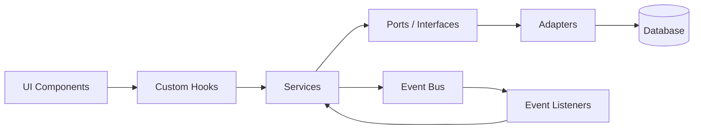
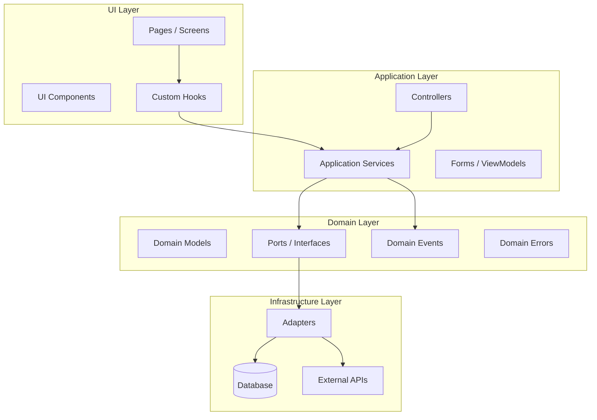

# Architecture

> Generated: 2026-06-07  
> Platform: **Web (Next.js)**  
> Modules: 17

---

## Stack Architecture

### Web (Next.js)

```
┌─────────────────────────────────────────────┐
│                  Browser                     │
├─────────────────────────────────────────────┤
│  React Components → Custom Hooks → Services  │
│         ↓ (API Calls via fetch/axios)         │
├─────────────────────────────────────────────┤
│  Next.js API Routes / Server Components       │
│  Zustand Store → Dexie.js (IndexedDB)          │
│         ↓                                     │
│  IndexedDB (via Dexie.js)                      │
└─────────────────────────────────────────────┘
```

## Data Flow



## Module Dependencies

```mermaid
graph TD
  M0["src/components/organisms\n[Component]"]
  M1["src\n[Module]"]
  M2["src/app\n[Module]"]
  M3["src/store\n[Module]"]
  M4["src/components/molecules\n[Component]"]
  M5["src/hooks\n[Hook]"]
  M6["src/components\n[Component]"]
  M7["src/components/atoms\n[Component]"]
  M8["src/lib\n[Module]"]
  M9["src/utils\n[Utility]"]
  M10["src/app/api/health\n[API Route]"]
  M11["src/app/api/latest\n[API Route]"]
  M12["src/app/api/v1\n[API Route]"]
  M13["src/context\n[Module]"]
  M14["src/contracts\n[Module]"]
  M15["src/middleware\n[Module]"]
  M16["src/types\n[Module]"]
```



| Module | Kind | Dependencies | Dependents |
|--------|------|--------------|------------|
| `src/components/organisms` | Component | 7 | 0 |
| `src` | Module | 6 | 0 |
| `src/app` | Module | 4 | 0 |
| `src/store` | Module | 3 | 0 |
| `src/components/molecules` | Component | 2 | 0 |
| `src/hooks` | Hook | 2 | 0 |
| `src/components` | Component | 1 | 0 |
| `src/components/atoms` | Component | 1 | 0 |
| `src/lib` | Module | 1 | 0 |
| `src/utils` | Utility | 1 | 0 |
| `src/app/api/health` | API Route | 0 | 0 |
| `src/app/api/latest` | API Route | 0 | 0 |
| `src/app/api/v1` | API Route | 0 | 0 |
| `src/context` | Module | 0 | 0 |
| `src/contracts` | Module | 0 | 0 |
| `src/middleware` | Module | 0 | 0 |
| `src/types` | Module | 0 | 0 |

## Clean Architecture Layers



---

*Generated by generate-docs.ts — 2026-06-07T16:09:14.433Z*
